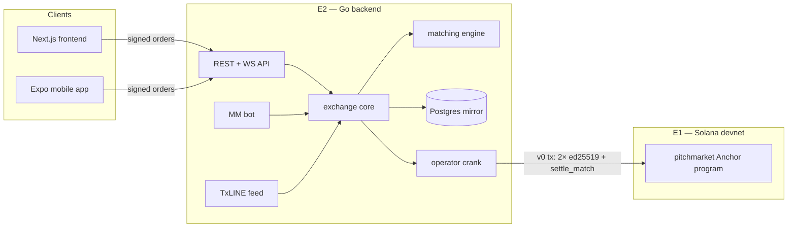

PitchMarket was built by two engineers on two parallel tracks, coding against a frozen
boundary document, [`docs/interface-contract.md`](https://github.com/Zerith-Studio/prediction-market/blob/main/docs/interface-contract.md).
Everything below is a map of that split.

## System overview

## E1 — the Anchor settlement program (`programs/pitchmarket/`)

A greenfield Anchor program (no fork) that owns all money movement:

- **Market** PDAs with two SPL outcome mints (YES/NO) and a collateral pool per market.
- Per-user **Vault** PDAs — deposit once, then trade silently.
- `settle_match` — verifies both users' ed25519 order signatures on-chain via
  instruction introspection, enforces per-order fill accounting, and executes the
  NORMAL/MINT/MERGE money movement.
- `resolve_market` (tier-a operator key today) and `redeem` (winning shares → USDC, 1:1).

Deployed on devnet at `3fdgRPcZnwWcaGi197dkZDyq24VHoWJcGzKTVfMxNPWs` — see
[On-chain program](/onchain/program) for the accounts and instruction surface.

## E2 — the Go backend (`backend/`)

- **`matching`** — a unified price-time-priority ladder that pairs NORMAL, MINT, and
  MERGE fills (see [Matching engine](/concepts/matching)).
- **`exchange`** — the trading core every order flows through: signature verify →
  soft-lock → match → Postgres mirror → crank → WebSocket events. Both the public API
  and the MM bot submit through it; nothing writes to the book or store directly.
- **`store`** — Postgres (Neon). Explicitly an *index and soft-lock ledger*: on-chain
  state is authoritative for money; `orders.remaining` mirrors the on-chain
  `OrderStatus`, never the other way around.
- **`crank`** — builds the pinned 3-instruction `settle_match` transaction (as a **v0
  transaction with a per-market address lookup table** — the legacy format is 1421+
  bytes, over the 1232-byte limit) and submits it. Falls back to an off-chain mirror
  mode when no chain is configured.
- **`rfq`**, **`precision`**, **`mmbot`**, **`lifecycle`**, **`feed`**, **`oneliner`**,
  **`index`** — combos, precision pools, two-sided MINT liquidity, market auto-creation
  and resolution from the TxLINE feed, AI one-liners, and the chain-state reconciler.

## Clients

- **`frontend/`** — Next.js app: markets index, market page with live ladder, combos
  builder, precision pools, portfolio with realized/unrealized PnL. Wallets via Privy
  embedded wallets (with a localStorage ed25519 fallback wallet). Orders are
  borsh-encoded and signed client-side; the TypeScript encoder is pinned to the same
  golden vector as the Rust and Go encoders and checked at build time.
- **`mobile/`** — Expo (React Native) app covering the core loop: markets, trade,
  deposit, portfolio. The library layer passed an end-to-end flow against a live
  backend; the UI screens are written but **unverified on a physical device** (per
  `progress.md`).

## The seams that keep it honest

1. **Five borsh encoders, one golden vector.** The signed `Order` message is encoded in
   Rust, Go, and TypeScript (web + mobile + test harness). A shared golden vector pins
   all of them byte-identical; touching any encoder means updating the same vector in
   every suite. See [Signed messages](/onchain/signed-messages).
2. **On-chain is truth for money.** Postgres soft-locks are UX; a `settle_match` revert
   unwinds the soft-lock and re-emits `order_update` (interface contract §6).
3. **All order flow goes through `internal/exchange`.** Skipping it would skip signature
   verification, soft-locks, the crank, or WS events.
