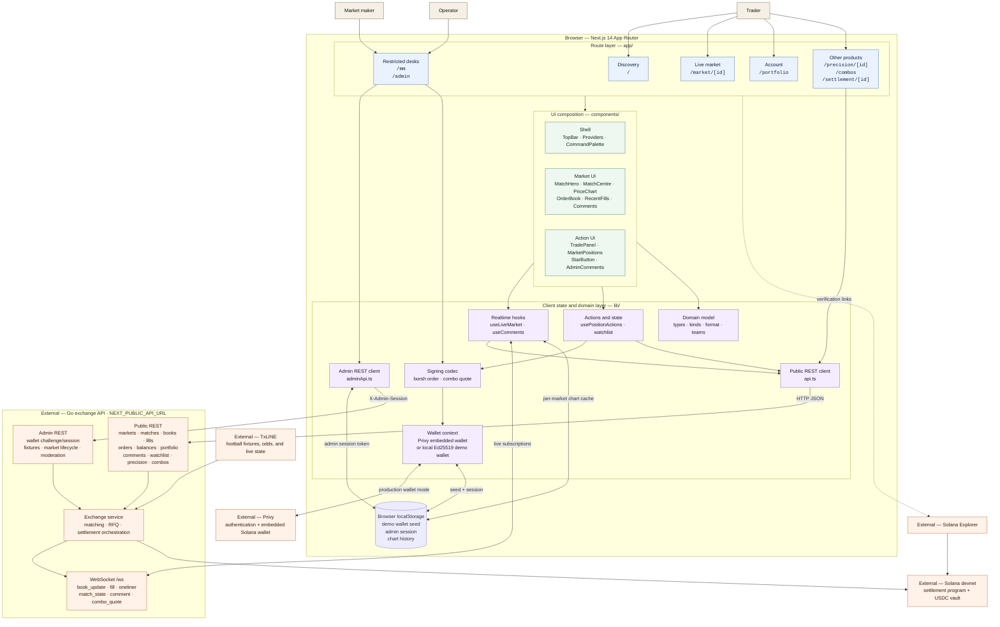

# PitchMarket frontend architecture

This diagram describes the code in `frontend/`. The Go exchange API, its data
stores and workers, TxLINE, and Solana are external to this directory, so they
are shown as system boundaries rather than frontend-owned components.

## Main runtime flows

1. **Read/live market:** a route gets its initial snapshot through `api.ts`, then
   `useLiveMarket` merges `/ws` events into the book, fills, match state, ticker,
   and chart history.
2. **Trade/exit:** the UI serializes an order with the Borsh codec, asks the
   selected wallet implementation for an Ed25519 signature, and posts the signed
   order to the exchange. The resulting book and fills return over WebSocket.
3. **Combo RFQ:** a taker creates an RFQ and polls for a quote; a market maker
   signs a Borsh combo quote; the taker accepts it through REST. The backend
   also exposes `combo_quote` on the shared WebSocket surface, although this
   frontend currently uses polling for that step.
4. **Administration:** an operator signs a server challenge, stores the returned
   session token locally, and sends it as `X-Admin-Session` for lifecycle and
   moderation calls.

## Deployment configuration

| Variable | Purpose |
| --- | --- |
| `NEXT_PUBLIC_API_URL` | Base URL for both REST and the derived `/ws` URL |
| `NEXT_PUBLIC_PRIVY_APP_ID` | Enables Privy; without it, the local demo wallet is used |
